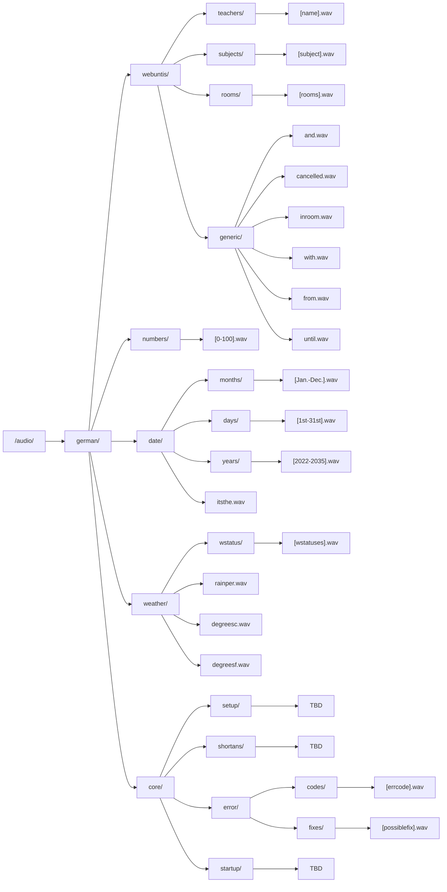

# LessonBuddy
This is Lesson Buddy. A voice assistant that sits on your shoulder, that's going to help you in your school life.
## Structures
### Folder structure

Click me

### Speech structure
- Lesson plan start
  > "Hier ist der Stundenplan von [heute/morgen]"
- Lesson info
  > "Du hast [Lesson name] bei [Teacher name] in Raum [Room name] von [Time begin] bis [Time end]"
- Lesson cancelled
  > "[Lesson name] bei [Teacher name] von [Time begin] bis [Time end] fällt aus"
- Time
  > "Es ist [Hour] Uhr"

  > "Es ist [Hour] Uhr [Minute]"
- Date
  > "Heute ist der [Day] [Month] [Year]"

  > "Es ist [Weekday] der [Day] [Month] [Year]"
- Weather
  > "[Heute/Morgen] wird es [Weather status] mit einer Regenwahrscheinlichkeit von [Rain percent]"

  > "[Heute/Morgen] wird es [Weather status]
- Error
  > "Es ist ein Fehler aufgetreten. Fehlercode [Error code]. [Possible fix]"

## Ideas
### Aesthetic
- "Buddy" round?
- Cable to connect "Buddy" to Case in black heatshrink
- LED in "Buddy" to indicate listening or errors
- Fabric on "Buddy" (maybe like the one on an Alexa)
- Case see-through
- One cable to connect (maybe with USB-Hub)
- Strap to right or left shoulder-strap on school bag

### Hardware
- Accelerometer to detect tapping
- Powerbank in Case

### Functions
- Give whole lesson plan
- Give infos about specific lesson
- Give infos about weather, date and time
- More general infos (maybe)
- Reminders for exams (maybe)

## ToDo
### Record audio
- [X] Intro
- [ ] Time numbers (0 - 60)
- [ ] Date numbers (1st - 31st)
- [ ] Date months (January - December)
- [ ] Date years (2022 - 2035)
- [ ] Weather
- [ ] Setup
- [ ] General answers

### 3D Print
- [ ] "Buddy"
- [ ] Case

### Program
- [ ] Speech recongnition (Google)
- [ ] Setup
- [ ] WebUntis API
- [ ] Config website
- [ ] Command handling
